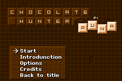
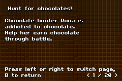
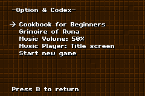
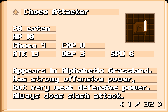
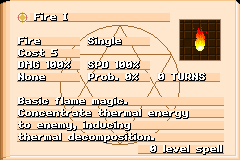
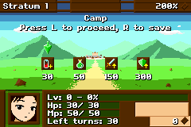
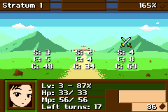
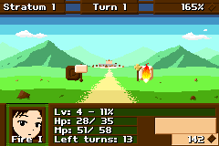

# Chocolate Hunter Runa

**GBA 2022 project**

Sequencial battle simulator game for GBA.\
You can select enemies to fight, and use various strategies to defeat them.

 
 

 

 
 

This game is made with Butano 10.5.0.\
https://github.com/GValiente/butano

-----

### Hunt for chocolates!

Chocolate hunter Runa is addicted to chocolate.\
Help her earn chocolate through battle.

+ #### In the camp

  Runa must eat enough chocolate in a certain amount of time.\
  She can extend her lifespan only if she eat chocolates.

  She can make potions by extracting ingredients from chocolate to recover her health.\
  But she cannot restore her lifespan with potions.

  Upgrading equipments by special magic costs a lot of chocolate, but it is worth it.\
  Weapon and armor can be upgraded.

  Press B twice to exit to the main menu, but unsaved data will be lost.

+ #### In the crossroad

  After each battle, you can choose one of the three paths to proceed.\
  Each path contains series of battles.\
  Press B to return to the camp.

  You can check the total number of battles (S), the number of enemies (E), amount of chocolate enemies have (C).

+ #### In the battlefield

  She can fight with two types of attack.\
  Melee type attack is physical element attack. It costs nothing, but weak.

  She can use various magic to strengthen herself or attack the enemies.\
  Most magic consumes mana.\
  She learns one spell at each level.

  Press select key to check Runa's stats and status effects in action select menu.\
  In target select menu, you can see current target's stats and status effects as well.

  At the end of battle, chocolates and experiences are gained.\
  The multiplier of the chocolates to get will decrease after every battle sequence.

  When the boss of stratum is defeated, game will proceed to next stratum, and chocolate multiplier is recovered.\
  When the chocolate multiplier is 100% or less, the boss appears.

+ #### Game over

  If health goes to zero or lifespan (turns) is over, the game is over.\
  You can see your current game's score and your best record ever.

+ #### Target type

  There are 5 types of action's target.\
  Self: action on self.\
  Single: select one target.\
  Multi: select a random target three times.\
  Enemies: target all enemies.\
  Entire: target all enemies & self.

+ #### Elements

  There are four types of elements: physical, fire, ice and lightning.\
  All enemies have resistance or weakness for each element.\
  Each attack has its element type.

+ #### Status effects

  Some attacks have the chance to cause status effects.\
  Types of status effects include raising/lowering stats, charge, guard, etc.\
  A maximum of five status effects are applied.

+ #### Codexes

  From the options menu, you can read the codexes for the enemies encountered and the spells learned.

+ #### Tips

  Each enemy has its own weaknesses and behavioral patterns.\
  Based on this information, you can gain the upper hand in battle.

  Avoiding enemies too much makes it difficult to deal with the boss later.\
  It can be advantageous to take out as many enemies as possible in your current state.

  Hold A button to speed up the battle.

-----

### Licenses

Source codes are licensed under the MIT license.\
Assets are licensed under several different licenses.
